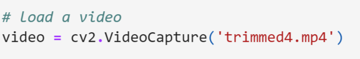

# Vechile Detection

## Project Description
Vehicle detection using image processing and classical machine learning

## Project Dependencies
- skimage version '0.18.1'
- sklearn version '0.24.1'
- numpy version '1.20.1'
- cv2 version '4.2.0'
- matplotlib version '3.3.4'

## How to use the project:
- Open the integration.ipynb file in a Jupyter notebook.
- In the following line, replace the string 'trimmed4.mp4' with a string containing the name of the video you want to run the project on.

  

- Run all cells.
