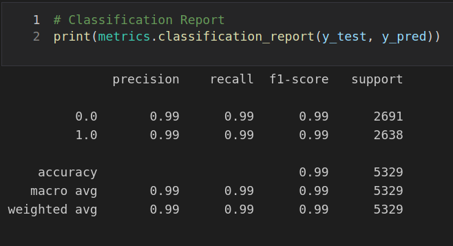
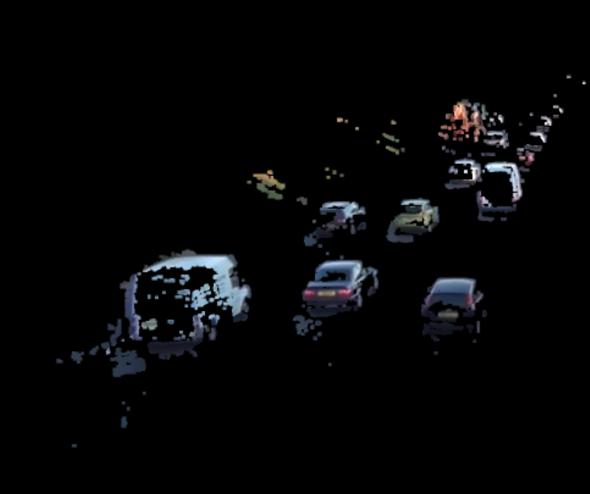
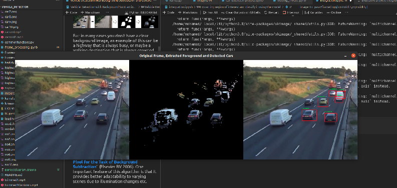
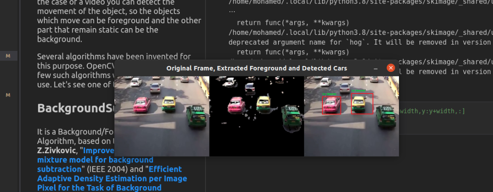

<h1 align="center">
  Classical Computer Vision- Vehicle Detection
</h1>
 

  <b> A Vehicle detection program that uses SVM model and MOG2 combined to detect moving vehicles in a video.
 </b>
   

# Description 
This project loads the video of the road then subtracts the backround to get the moving foreground objects and classify each object to know whether it is a vehicle or not.

# Model Training (SVM model)

1. Load the dataset and put them into two numpy arrays(one for vehicles and one for non vehcles), vehicles images used :https://s3.amazonaws.com/udacity-sdc/Vehicle_Tracking/vehicles.zip , non-vehicles images: https://s3.amazonaws.com/udacity-sdc/Vehicle_Tracking/non-vehicles.zip 
2. We splitted the data into training and testing sets.

3. We wanted to avoid our model from getting overfit so we augmented the training-set by flipping, rescaling and changing the brightness of the images.
4. For feature extraction we used the Histogram of gradients HOG and SIFT as features and then flattened them and concatenated them into one feature vector for each image
5. We fed the SVM model the feature vectors of the images and crossed our fingers it will learn well.
6. That's the Classification report:  

# Integration 
1. Load the video and the pre trained model
2. Use mixture of gaussians function from opencv MOG2 for background subtraction 
3. The remaining will be the moving foreground objects.
4. We use the SVM model on the controus of the foreground objects to know whether it is a vehicle or not.
5. Put a bounding box on detected vehicle 

- After removing background

- Full output 

 ## Papers references
1.Linear SVM Classifier Based HOG Car Detection
2.Histograms of Oriented Gradients for Human Detection 
3.Improved Adaptive Gaussian Mixture Model for Background Subtraction

